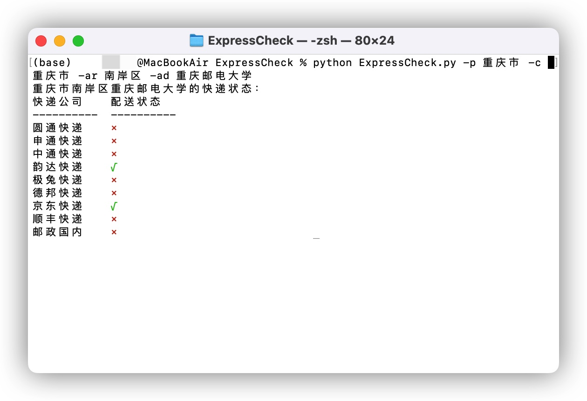
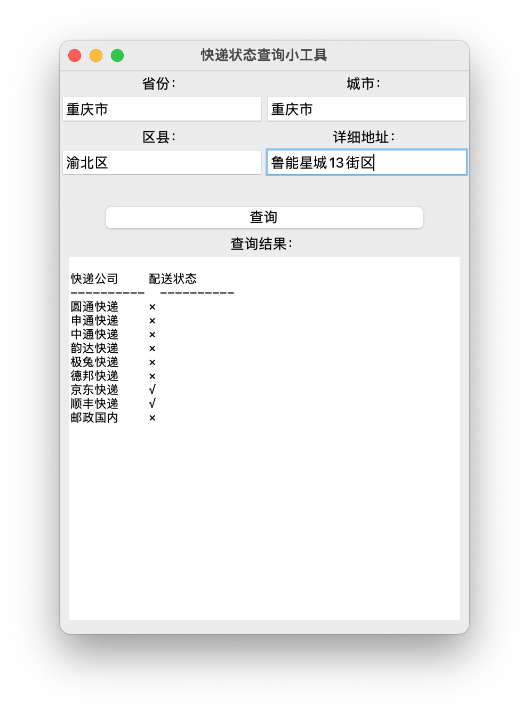

# ExpressCheck
### English
If there is a COVID-19 outbreak in your area, you may not be able to receive some express. You can use this tool to check the express status of your area.\
Usage:\
Firstly you should **cd** to your file address which has the ExpressCheck.py\
**python ExpressCheck.py [-h|--help]** to get help\
**python ExpressCheck.py [-p|--province] PROVINCE [-c|--city] CITY [-ar|--area] AREA [-ad|--address] ADDRESS** to check the status of your area\
If something is missing, you can use **pip install -r requirements.txt** to install them.\
**If you want to use the tool directly, you can double-click ExpressCheck_macOS/Windows/Linux or download it on the release page.**

### 中文
如果您所在的地区出现新冠疫情，你可能会收不到一些快递公司的快递。您可以使用此工具来确认您所在地区的快递状态。\
用法：\
首先使用 cd 命令进入 ExpressCheck.py 文件所在的目录下\
**python -h** 命令可以获得使用帮助\
**python ExpressCheck.py [-p|--province] 省份 [-c|--city] 城市 [-ar|--area] 区 [-ad|--address] 详细地址** 启动脚本查询快递状态（直辖市省份与城市相同）\
如果提示缺少依赖包，您可以通过 **pip install -r requirements.txt** 来安装它们。\
**如果您想直接使用该工具，您可以通过release下载或双击项目中的 ExpressCheck_macOS/Windows/Linux 应用程序。**

### 示例：

使用命令行查询：

python ExpressCheck.py -p 北京市 -c 北京市 -ar 海淀区 -ad 清华大学

使用图形界面查询：

